# Apuntes-U1

# 1.1 Historia de la graficación por computadora

La computación gráfica es el campo de la informática visual, donde se utilizan computadoras tanto para generar imágenes visuales sintéticamente como integrar o cambiar la información visual y espacial probada del mundo real.
Un gráfico es cuando existe algún trazo o marca que han sido hechos con intencionalidad. Lo gráfico, tiene por objeto representar (tomar el lugar de, o de presentar de nuevo) alguna cosa que no está.

## Decada de los 50´s

- 1950: El artista y matemático Ben Laposky crea las primeras imágenes gráficas mediante osciloscopios. Poco después, el MIT desarrolla la Whirlwind Computer, la primera capaz de procesar video en tiempo real e interactuar mediante un dispositivo revolucionario: el "lápiz óptico" (light pen).
  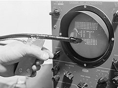

- 1955: Nace el sistema SAGE en la Guerra Fría, capaz de procesar datos de distintos radares para mostrar una imagen unificada del espacio aéreo.

  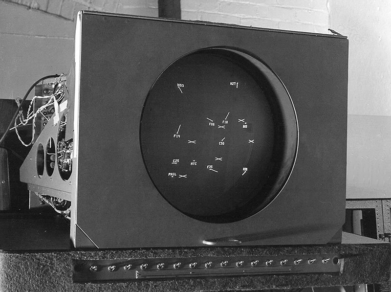
  
- 1958-1959: El cine y la industria dan sus primeros pasos digitales. John Whitney (padre de la animación por computadora) crea una secuencia animada para la película Vértigo, y General Motors desarrolla DAC-1, el primer programa de diseño asistido por computadora (CAD) para digitalizar modelos de autos en 3D.

## Decada de los 60´s

- 1960: William Fetter acuña oficialmente el término "Computer Graphics".

- 1962: Nace Spacewar, uno de los primeros videojuegos multijugador, y Jack Bresenham desarrolla un algoritmo matemático fundamental para trazar líneas rectas en pantallas de píxeles.
  
  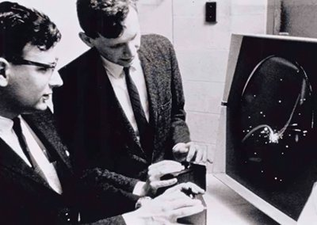
  

- 1963: Ivan Sutherland diseña Sketchpad, considerado el padre del CAD actual y precursor de la interfaz gráfica de usuario (GUI), integrando conceptos como el "zoom". En este mismo año, se materializa el primer prototipo de mouse (ratón).

- 1967: Steven Coons publica el "Parche de Coons", base matemática que todavía se usa hoy para representar curvas y superficies tridimensionales complejas.

## Decada de los 70´s

- 1971-1975: Se perfeccionan técnicas para dar volumen y realismo a los objetos 3D: surgen el sombreado de Gouraud y el sombreado de Phong, además del mapeo de texturas.
  
  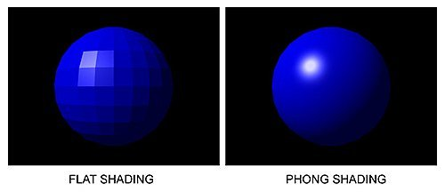

- 1972: Atari lanza Pong, el primer videojuego en lograr un éxito comercial masivo.

- 1973-1976: Películas como Westworld y su secuela Futureworld son pioneras absolutas al incorporar animaciones digitales y modelos tridimensionales en el cine.

- 1977-1979: Apple presenta la Apple II (primera PC con pantalla a color) y John Turner Whitted introduce el Ray Tracing, un algoritmo para simular de forma realista el comportamiento de la luz.

## Decada de los 80´s

- 1982: La película Tron hace historia al incluir 15 minutos ininterrumpidos de gráficas generadas totalmente por computadora (CGI).

- 1984-1986: Surge Polhemus, el primer software de diseño 3D, y Pixar lanza su icónico cortometraje fundacional, Luxo Jr.
  
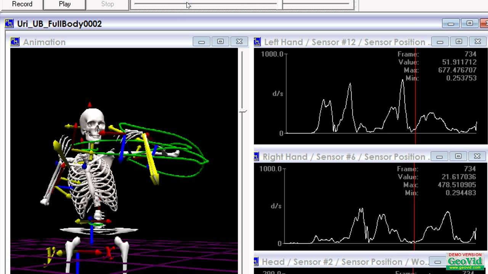

- 1987-1989: La industria tecnológica comienza a estandarizarse con la llegada del formato de salida de video VGA (introducido por IBM) y la fundación de la asociación VESA.

## Decada de los 90´s

- 1990-1992: Pixar desarrolla el potente software de renderizado Renderman, y se establece OpenGL, una API estándar para crear aplicaciones con gráficos 2D y 3D.

- 1993: Surge Mosaic, el primer navegador web gráfico. En el cine, Jurassic Park logra el hito de integrar efectos gráficos realistas compartiendo pantalla simultáneamente con actores de carne y hueso.

- 1995: Pixar estrena Toy Story, la primera película animada generada en su totalidad por computadora.

- 1999: NVIDIA lanza su primera familia de tarjetas GeForce 256.
  
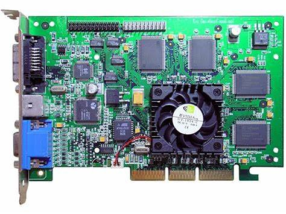

## Decada de los 2000´s y la actualidad

- 2001-2003: Se busca el fotorrealismo humano con la película Final Fantasy y surgen potentes motores gráficos como el Id Tech 4 para procesar videojuegos muy avanzados como Doom 3.

- 2015-2018: Las técnicas de iluminación global mejoran dramáticamente y el Ray Tracing (trazado de rayos) da el salto al tiempo real, aplicándose directamente en los videojuegos para una inmersión visual superior.

- Actualidad: Los gráficos por computadora son el pilar del entretenimiento moderno. El hardware se ha vuelto tan potente y pequeño que llevamos tarjetas de video en nuestros smartphones, y herramientas de desarrollo (como los modernos motores de videojuegos) han automatizado procesos que antes eran titánicos.

# 1.2 Áreas de aplicación

## Principales Aplicaciones de la Graficación por Computadora

- Diseño Asistido por Computadora (CAD): Herramienta fundamental para crear modelos 3D realistas (con simulación de iluminación e interiores) aplicados en arquitectura, ingeniería (vehículos, aeronaves) y diseño industrial.

- Ciencia y Topografía: Permite la visualización de microestructuras complejas (como moléculas) y la creación de cartografía detallada (mapas de relieve y vegetación) a partir de sensores satelitales.

- Medicina: Facilita diagnósticos precisos y simulaciones de intervenciones quirúrgicas de menor riesgo mediante representaciones 3D del interior del cuerpo humano.

- Entretenimiento y Arte Gráfico: Es el motor principal para la creación de efectos visuales en cine, videojuegos, diseño de logotipos escalables, arte comercial/publicitario y simuladores virtuales de alto realismo.

- Educación y Entrenamiento: Se usa para crear simuladores para operadores de vehículos y entornos virtuales de aprendizaje interactivo (sistemas multimedia) para estudiantes.

# 1.3 Aspectos matemáticos de la graficación
Uno de los aspectos mas importantes de la Graficacion por computadora es la geometría, ya que esta es la base para los gráficos en los software.

La geometría es fundamental para el desarrollo de software de gráficos. Los científicos y programadores de computadoras estudian geometría fractal, geometría descriptiva y perspectiva lineal, que es la geometría 3D, para desarrollar matemáticamente el dibujo de objetos en vez de dibujar con un mouse o un bolígrafo y un lápiz.

### Geometría fractal

Sencillamente es el utilizar figuras geométricas de forma repetitiva para crear una figura geometrica. Por ejemplo el utilizar un triangulo dentro de otro triangulo, y este a su vez con un triangulo dentro para asi formar un triangulo mas grande.
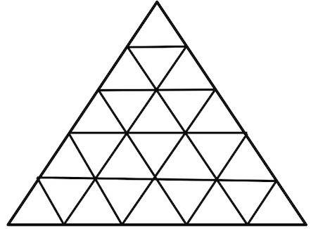

Ésta geometria tiene su origen en el concepto de proceso iterativo introducido hace ya 300 años por Isaac Newton y Gottfried Leibniz. De forma esquemática, un proceso iterativo consta de: una unidad de entrada compuesta por un dato inicial. Esta unidad de entrada alimenta la unidad de proceso, cerebro pensante del proceso iterativo, que manipula la información recibida y produce un nuevo dato que constituye la unidad de salida. Este nuevo dato será posteriormente utilizado por la unidad de entrada para volver a alimentar la unidad de proceso, y así sucesivamente.

# 1.4 Modelos del color: RBG, CMY, HSV y HSL.

## ¿Qué es un modelo de color?
Es un estándar matemático (usualmente basado en un conjunto de colores primarios) que, mediante mezclas, permite representar visualmente una amplia gama de colores. Se dividen en dos tipos:

- Aditivos: Suman luz para crear colores (su mezcla total da color blanco).
- Sustractivos: Absorben o "restan" luz mediante pigmentos (su mezcla total da color negro).

## Principales Modelos de Color

### RGB (Red, Green, Blue):

- Tipo: Aditivo.
- Uso: Pantallas, monitores y dispositivos digitales (emiten luz).
- Característica: Combina rojo, verde y azul. La mezcla de los tres al 100% genera luz blanca.

### CMY / CMYK (Cyan, Magenta, Yellow + Key/Black):

- Tipo: Sustractivo.
- Uso: Impresoras y artes gráficas (tintas y pigmentos).
- Característica: Mezcla cian, magenta y amarillo para crear colores oscuros. Se le añade la "K" (Negro puro) porque la mezcla de los tres primeros suele dar un tono café sucio en la vida real, mejorando así el contraste y ahorrando tinta.

### HSV (Hue, Saturation, Value / Tono, Saturación, Valor):

- Tipo: Cilíndrico (basado en la percepción humana).
- Características: * Hue: El color puro (matiz).
- Saturation: La cantidad de blanco mezclado con el color (pureza).
- Value: La cantidad de negro mezclado con el color (brillo).

### HSL (Hue, Saturation, Lightness / Tono, Saturación, Luminosidad):

-Tipo: Cilíndrico.
- Diferencia con HSV: Funciona muy similar, pero el parámetro "L" (Luminosidad) actúa diferente: si la luminosidad está al máximo (100%), el color siempre será blanco puro, sin importar qué tono o saturación tenga. Es el modelo más usado en fotografía (como Lightroom) y diseño web.

## Tutorial de como iluminar un cubo y sus caras en blender

## Iluminar un cubo
### Paso 1
Ir al apartado de blender "Material", en la imagen se logra apreciar en donde es el apartado.
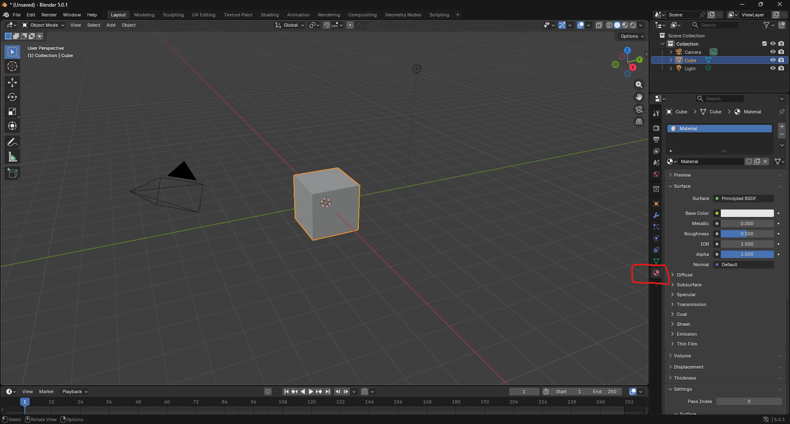

### Paso 2
Seleccionar la opcion de "Base Color" y elegir un color de eleccion
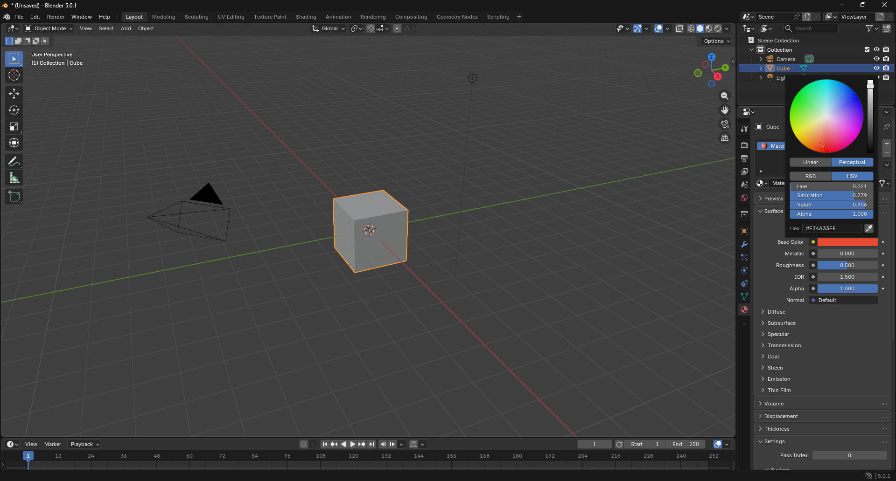
### Paso 3
Apretar la tecla "F12" para que te muestre el renderizado
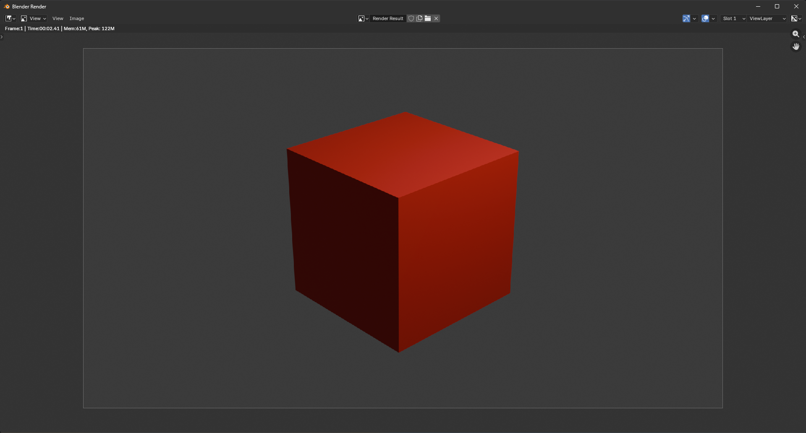

## Colorear sus caras
Estando en la misma seccion que en el de Iluminar cubo iremos al apartado de "edit mode" y daremos en la seccion donde podemos editar caras.
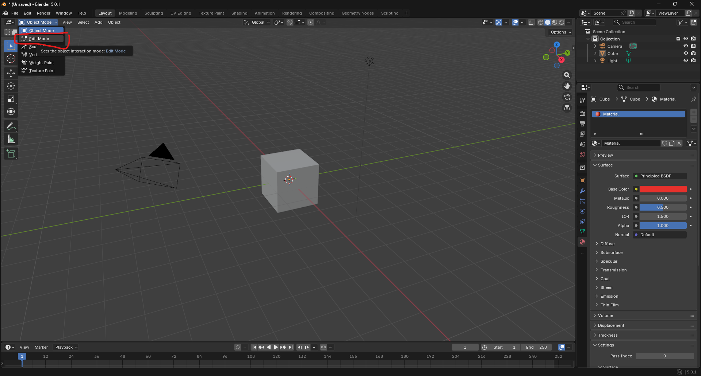
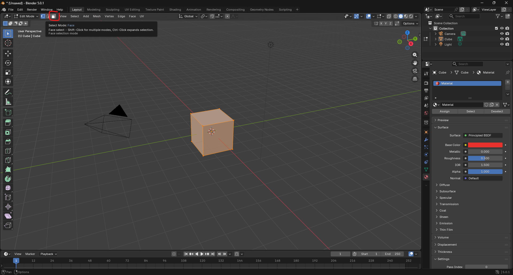

Ahora creamos un nuevo material, damos click en agregar un nuevo material y se creara un nuevo material para la cara que hayamos elegido, a este le cambiaremos el color como en el paso 2 del anterior tutorial y le asignaremos el color azul
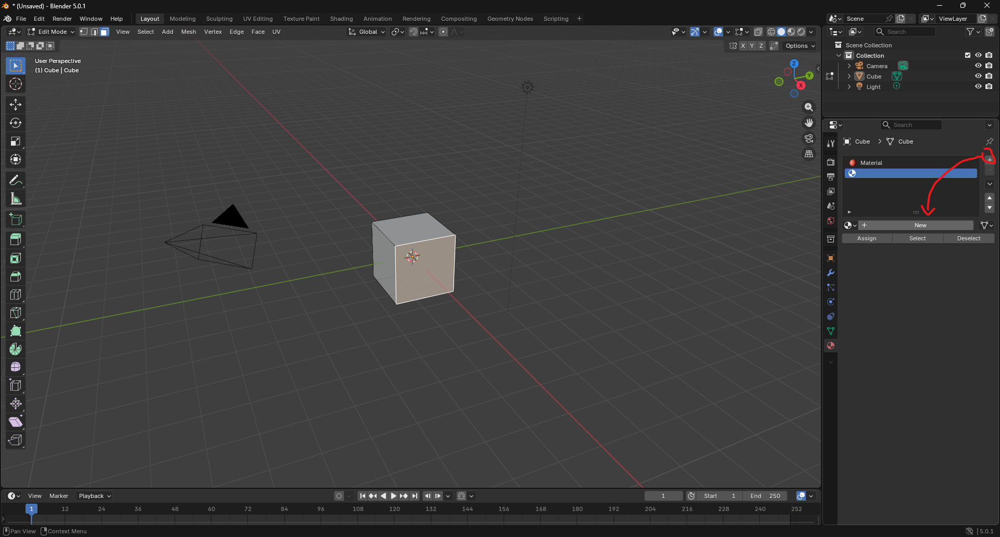

Resultados:
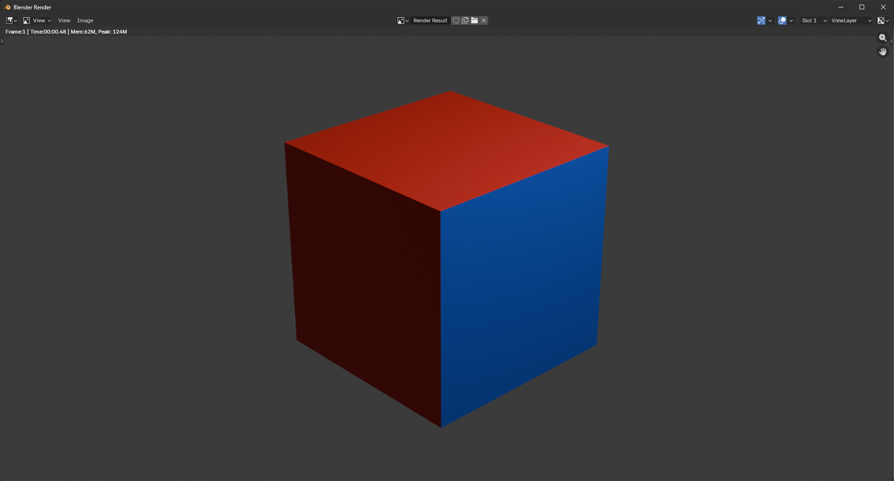

# 1.5 Representación y trazo de líneas y polígonos

  ## Poligono
Es una superficie plana y cerrada, delimitada por un contorno formado por segmentos rectos unidos en sus extremos.

  ### Elementos básicos:

- Lados: Cada uno de los segmentos rectos que forman el contorno.
- Vértices/Ángulos: Los puntos exactos donde se unen dos lados consecutivos.
- Regla básica: Para que exista un polígono, debe tener obligatoriamente tres o más lados y ángulos.

  ## Politopo
Un polígono es simplemente la versión bidimensional (2D) de lo que en matemáticas se conoce como politopo.
Un politopo es el término general para referirse a estas figuras geométricas sin importar su número de dimensiones (por ejemplo, un cubo en 3D es un politopo).

  ## Representación en Computación Gráfica (Ejemplo: OpenGL)

- Construcción de imágenes: En la graficación, las formas se construyen limitándose a organizar polígonos regulares e irregulares formados por vértices.
- Primitivas geométricas: Bibliotecas gráficas estándar como OpenGL trabajan con formas muy básicas: puntos, líneas y polígonos. Todo objeto complejo se describe uniendo los vértices de estas primitivas.
- Coordenadas: Para que la computadora entienda dónde está un vértice, usa números de punto flotante. Utiliza coordenadas cartesianas (x, y) para gráficos 2D y (x, y, z) para entornos 3D. También existen las coordenadas homogéneas (x, y, z, w) para realizar cálculos matemáticos más complejos en el renderizado 3D.

 ## 1.5.1 Formatos de imagen.
 El formato de una imagen es la estructura que eliges para que defina la forma en la que queda guardada. Es decir, los tipos de formato de imagen digital representan un tipo de archivo electrónico. De esta forma, el formato es lo que indica al ordenador la información necesaria para convertir la información en el código.

 ### JPEG
 El formato Jpeg o, como también se le conoce, JPG , es probablemente el más famoso y utilizado de todos. Puedes utilizarlo para medios digitales, ya que es un soporte universal para todos los navegadores y sistemas operativos. Por esta razón es uno de los tipos de formatos de imágenes para páginas web más utilizados. Además, el tamaño del archivo es reducido.
 ### GIF
 Es el formato más famoso y utilizado cuando se trata de imágenes animadas. Permite mantener el tamaño de las animaciones reducido, de forma que es ideal para compartirlo a través de Internet y de las redes sociales. Sin embargo, la limitación de 8 bits también conlleva que se pierda calidad de la imagen, que siempre se va a ver limitada.
 ### PNG
 En este caso la imagen se muestra con mayor calidad, es decir, se pierden menos detalles y los textos son muy visibles y legibles, por eso es uno de los más utilizados en diseño gráfico. Sin embargo, no es el ideal para las webs, ya que también pueden suponer que el sitio web se ralentice si se utilizan en exceso.
 ### PSD
 Es el formato de Adobe Photoshop para guardan imágenes y proyectos. La calidad de imagen no tendrá perdidas, pero el archivo tendrá un tamaño muy grande.
Es un archivo de imagen vectorial con el que podrás almacenar ilustraciones. También podrás escalar la imagen sin perdidas y se recomienda utilizarlo como soporte de impresoras.
### SVG
En este caso se trata de un formato vectorizado y que ofrece un tamaño reducido para los archivos sin que se pierda calidad para las ilustraciones o los textos a pesar de escalarlo. Sin embargo, si se trata de imágenes muy complejas no es el formato más adecuado.
### RAW
Se trata de un formato de imagen en bruto. No está pensado para las páginas web ni para ser compartidas, ya que su tamaño será gigante. Sin embargo, la calidad será también enorme.

### Practicas
#### Poligono
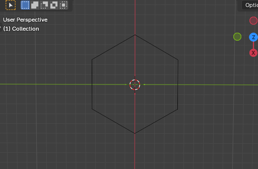
#### Flor de la vida
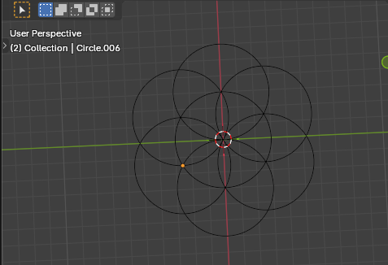

# 1.6 Procesamiento de mapas de bits.
Existen dos tipos principales de imágenes digitales: los mapas de bits, en los que la imagen se crea mediante una rejilla de puntos de diferentes colores y tonalidades, y los gráficos vectoriales, en los que la imagen se define por medio de diferentes funciones matemáticas.
Las imágenes de mapa de bits (bitmaps o imágenes raster) están formadas por una rejilla de celdas, a cada una de las cuales, denominada píxel (Picture Element, Elemento de Imagen), se le asigna un valor de color y luminancia propios, de tal forma que su agrupación crea la ilusión de una imagen de tono continuo.

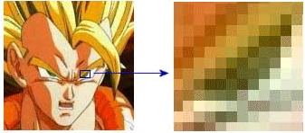

Un píxel es una unidad de información, pero no una unidad de medida, ya que no se corresponde con un tamaño concreto. Un píxel puede ser muy pequeño (0.1 milímetros) o muy grande (1 metro).

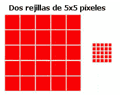

Una imagen de mapa de bits es creada mediante una rejilla de píxeles única. Cuando se modifica su tamaño, se modifican grupos de píxeles, no los objetos o figuras que contiene, por lo que estos suelen deformarse o perder alguno de los píxeles que los definen. Por lo tanto, una imagen de mapa de bits está diseñada para un tamaño determinado, perdiendo calidad si se modifican sus dimensiones, dependiendo esta pérdida de la resolución a la que se ha definido la imagen.

Los gráficos de mapa de bits se obtienen normalmente a partir de capturas de originales en papel utilizando escáneres, mediante cámaras digitales o directamente en programas gráficos. También existen multitud de sitios en Internet que ofrecen imágenes de este tipo de forma gratuita o por una cantidad variable de dinero.

# Referencias bibliograficas
- Sutori. (s. f.). Sutori. https://www.sutori.com/es/historia/historia-y-evolucion-de-la-graficacion-por-computadora--HWxiLPJRpHqkjwYoadxpmheZ
- Área de aplicación de la graficación por computadora. (s. f.). https://grafidepc.blogspot.com/p/area-de-aplicacion-de-la-graficacion.html
- 1.4 Aspectos matemáticos de la graficación (Geometría Fractal)  :: Entrega-de-proyectos. (s. f.). https://entrega-de-proyectos.webnode.mx/graficacion/introduccion-a-los-ambientes-de-graficacion/a1-4-aspectos-matematicos-de-la-graficacion-geometria-fractal/
- Modelos de color RGB, CMY, HSV y HSL. (s. f.). https://graficaciontmmjc.blogspot.com/2019/03/modelos-de-color-rgb-cmy-hsv-y-hsl.html
- Valdes, A. S. (2013, 22 septiembre). 2.2  Representación y trazo de poligonos. https://graficacionito.blogspot.com/2013/09/22-representacion-y-trazo-de-poligonos.html
- Admin. (2024, 2 octubre). Tipos de formatos de imágenes | Distintos archivos digitales. Ahdis Creativos. https://www.ahdis.com/blog/tipos-formatos-imagenes/
- Gráficos de mapas de bits. (s. f.). DesarrolloWeb.com. https://desarrolloweb.com/articulos/1755.php
